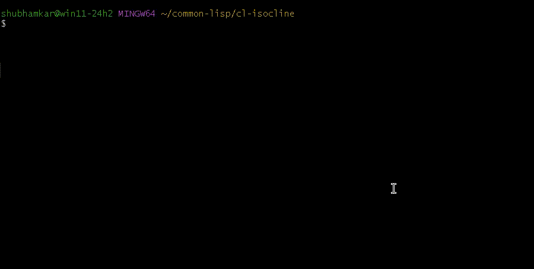

isocline and isocline-repl (Common Lisp)
---

[Isocline](https://github.com/daanx/isocline) is an alternative to
libreadline, libedit and the likes, that is

-   MIT licensed
-   Pure C
-   Portable across Unix, Windows, MacOS
-   Supports multiline editing out of the box
-   ... and much more ...

This means it works as an awesome portable repl for Common Lisp, across
operating systems and lisp implementations.

The current repository contains source code for version 1.0.9 of
Isocline, along with [lisp bindings](lisp/isocline.lisp) and a [simple
repl](lisp/isocline-repl.lisp).



# Installation

## Binaries

Currently standalone binaries are available for Windows. See the
[Releases](https://github.com/digikar99/cl-isocline/releases/).

Once installed, the package manager quicklisp can be installed using:

```lisp
(ql-https:ensure-quicklisp)
```

This assumes the availability of `curl openssl tar git`. Recommended way to obtain these is using [MSYS2](https://www.msys2.org/). Once MSYS2 is installed, open the MINGW terminal and:

```sh
pacman -S git openssl
```

## Compiling from source

### Lisp compiler (or interpreter)

We default to [sbcl](http://sbcl.org).

#### Linux

```sh
sudo apt install sbcl
```

#### MacOS

Skip [homebrew](https://brew.sh) unless installed:

```sh
/bin/bash -c "$(curl -fsSL https://raw.githubusercontent.com/Homebrew/install/HEAD/install.sh)"
```

Install sbcl

```sh
brew install sbcl
```

#### Windows

1. Install [MSYS2](https://www.msys2.org/).
2. Launch the "MSYS2 MINGW" terminal.
3. `pacman -S mingw-w64-x86_64-sbcl`

### Quicklisp client

[rudolfochrist/ql-https](https://github.com/rudolfochrist/ql-https) is a
quicklisp client variant that uses https.

```sh
curl https://raw.githubusercontent.com/rudolfochrist/ql-https/master/install.sh | bash
```

### Ultralisp

```lisp
;; ql-https will upgrade the URLs from http to https
(ql-dist:install-dist "http://dist.ultralisp.org/" :prompt nil)
```

### isocline-repl

If you have ultralisp installed, then you can

```lisp
(ql:quickload "isocline-repl")
(isocline-repl:main)
```

This assumes you have `gcc` installed. It will be used to compile `libisocline.so` from the sources.

### Binary

The following should create a `cl-isocline-repl` in the root
directory of `isocline-repl`.

```lisp
(asdf:make "isocline-repl")
```

# TODO

Contributions welcome!

- [x] History
- [x] [ql-https](https://github.com/rudolfochrist/ql-https) bootstrapping
- [x] Debugger Support
- [ ] Compile standalone binaries for MacOS
- [ ] Compile standalone binaries for Linux
- [ ] Add completion support
- [ ] Better copy-paste support
- [ ] Easy: Ship with [CIEL](https://ciel-lang.org/)
- [ ] Easy: Process command line arguments (load, eval) with unix-opts
- [ ] Easy: Add a dumb mode so that it can work directly with SLIME or the likes
